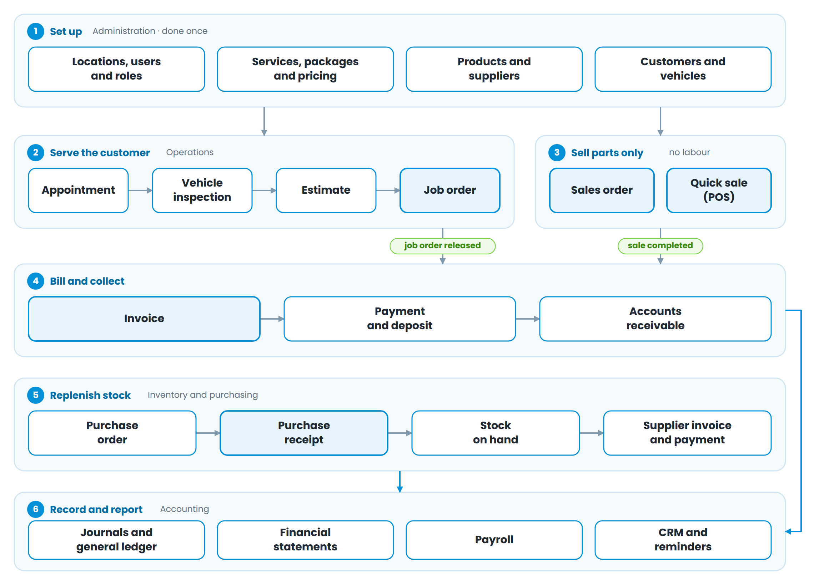

# Overview

This guide follows a vehicle, a part and a peso through the system, from the moment a customer books to the moment the money lands in the ledger. Every screen you will use appears somewhere in one of the nine flow charts, and every status a document can carry is listed with what it actually does.

## How to use this Guide
Read Section 2 first — the one-page map of the whole system. After that, each part stands on its own, so you can turn straight to the process you are being trained on.

Three conventions run through the document:

  - **Status names** are written exactly as they appear on screen: *Open*, *In Process*, *Released*.

  - **Stock effects** are called out wherever a step moves inventory, because that is where mistakes are expensive.

  - **Setting** marks behaviour that your branch can turn on or off in Location Settings, so your screens may differ slightly from a colleague's at another branch.

## The system at a glance

Work flows through six layers. You set the business up once, then the day-to-day cycle runs from left to right and top to bottom.

Figure 1 — The six layers of the system and how documents pass between them

The important thing to notice is that **almost everything ends in an Invoice**. A job order, a sales order and a quick sale are three different ways of getting to the same place, chosen by what the customer needs:

| **The customer needs**       | **Use**     | **Because**                                |
| ---------------------------- | ----------- | ------------------------------------------ |
| Labour, or labour and parts  | Job Order   | It carries mechanics, hours and a vehicle  |
| Parts only, ordered ahead    | Sales Order | Parts are reserved until collection        |
| Parts only, over the counter | Quick Sale  | Payment and hand-over happen at once       |
| A price before committing    | Estimate    | It converts into a Job Order once approved |

## Before you start: the set-up data
Nothing in the operations screens works until the reference data behind it exists. Set it up in this order — each row depends on the ones above it.

| **Set up**                                     | **Where**      | **Why it comes first**                                                      |
| ---------------------------------------------- | -------------- | --------------------------------------------------------------------------- |
| Locations, users, roles                        | Administration | Every document belongs to one location; permissions decide what a user sees |
| Parameters and system numbers                  | Administration | Statuses, terms and the reference-number series for each document           |
| Services, service groups, packages             | Administration | Labour lines and their standard hours and rates                             |
| Products, categories, manufacturers            | Inventory      | Parts, part numbers, units and vehicle applications                         |
| Product pricing and pricing tiers              | Administration | Sell prices, price overrides, quantity breaks, tier prices per customer     |
| Suppliers                                      | Inventory      | Needed before a purchase order can be raised                                |
| Vehicle makes, models and inspection templates | Administration | Drive the vehicle picker and the inspection checklist                       |
| Customers and their vehicles                   | Customers      | Can also be created on the fly from a job order                             |

|                                                                                                                                                                                                                                                                                                                                         |
| --------------------------------------------------------------------------------------------------------------------------------------------------------------------------------------------------------------------------------------------------------------------------------------------------------------------------------------- |
| **Pricing is layered.** A product's sell price can be overridden by a pricing tier attached to the customer, and again by a quantity break. A service's rate can be overridden by a classification rate tied to the vehicle's model class. The system applies the most specific rule it finds — you do not have to work it out by hand. |
