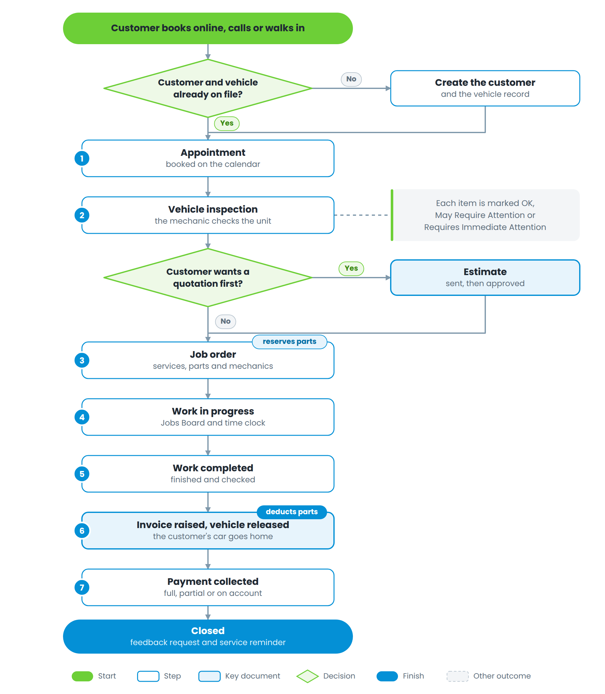
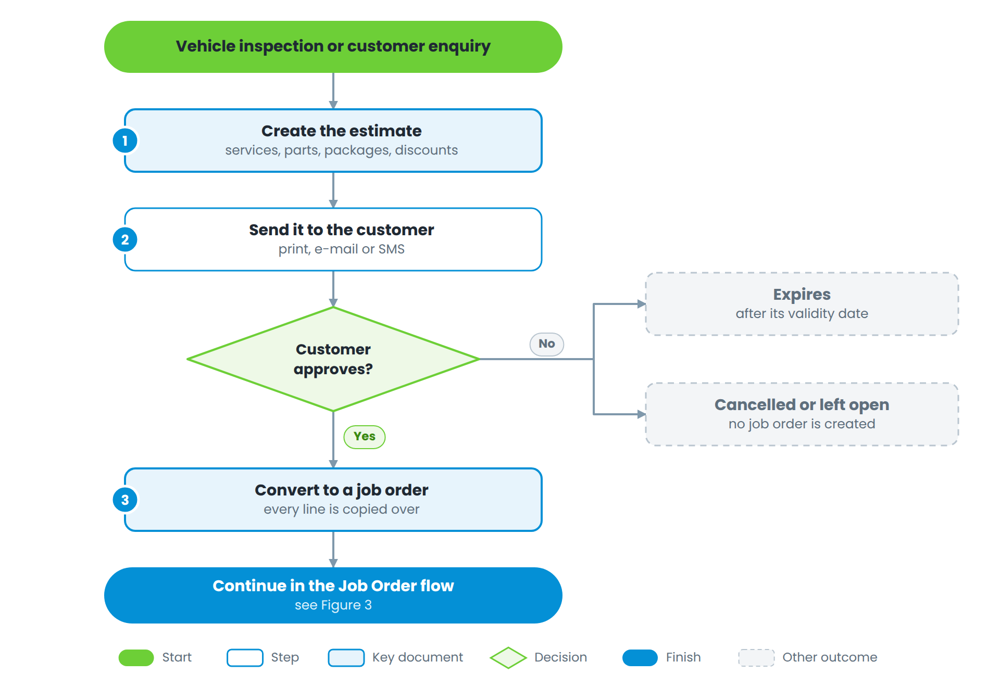
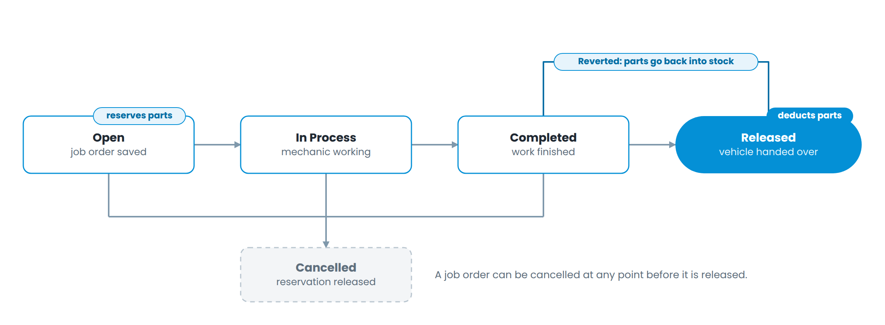

# Part 1 — The service cycle

## The cycle end to end

Figure 2 — From booking to closed job, with the two decision points that change the path

## Customers and vehicles

A vehicle belongs to a customer, and every job order, estimate and inspection is written against a vehicle. If the customer is new, you do not have to leave the job order screen — the plus button beside the Customer field creates the customer, and the plus beside the Vehicle field creates the vehicle against that customer.

When you pick a vehicle, three things happen automatically:

1.  The VIN appears beside the vehicle label.

2.  The customer is filled in, if you started from the vehicle.

3.  If the vehicle has **open inspection items**, a red badge shows the count beside the vehicle label. Click it to see them — see Section 1.4.

## Appointments

Appointments can be booked by your staff or by the customer through the public booking link. They are a diary, not a document — nothing moves in stock or money until a job order is raised.

| **Status** | **Meaning**                                                       |
| ---------- | ----------------------------------------------------------------- |
| Pending    | Requested through the booking page, not yet confirmed by the shop |
| Scheduled  | Confirmed and on the calendar                                     |
| Attended   | The customer arrived; a job order is normally raised now          |
| No Show    | The customer did not arrive                                       |
| Cancelled  | Called off by either side                                         |

Appointment reminders and service reminders are configured separately under CRM and go out by SMS on the schedule you set.

## Vehicle inspection

An inspection is a checklist run against a template. The mechanic marks every item with one of three findings:

| **Finding**                  | **Shown as** | **What it means**           |
| ---------------------------- | ------------ | --------------------------- |
| Okay                         | no marker    | Nothing to do               |
| May Require Attention        | orange dot   | Should be watched or quoted |
| Requires Immediate Attention | red dot      | Should be fixed now         |

Items that are not *Okay* and not yet completed are **pending inspection items**. They stay attached to the vehicle until somebody deals with them, which is what makes them useful months later.

**Working the pending items from a job order or estimate.** Select the vehicle, then click the red badge beside the Vehicle field. A window lists every pending item with the mechanic's notes and the needed service. Each row has two buttons:

  - **Add** — copies the item's needed service into the Labour section of the job order or estimate, at the correct rate and standard hours.

  - **Done** — marks the inspection item completed, with a date and remarks, exactly as the Vehicle → Inspections screen does. The badge count drops as you go.

An item with no needed service set can still be marked *Done*, but there is nothing to add — set a needed service on the inspection item if you want it to be quotable.

## Estimates

An estimate is a quotation. It looks and behaves like a job order, but it reserves nothing and bills nothing.

Figure 3 — The life of an estimate

Steps:

1.  Create the estimate against the customer and vehicle. Add services, parts and packages. Use the magnifier on the **Parts & Materials** header to search the catalogue by name, part number, manufacturer or category — and tick *Filter by Estimate Vehicle* to see only parts that fit the car in front of you.

2.  Set the validity date. After that date the estimate shows as expired.

3.  Send it — print, e-mail or SMS.

4.  When the customer approves, convert it to a job order. Every service and part line is copied across.

## Job orders

The job order is the centre of the system. It carries the vehicle, the labour, the parts, the mechanics and the money.

Figure 4 — Job order statuses. Parts are reserved on save and only deducted on release

| **Status** | **What has happened**                        | **Effect on stock**                                                  |
| ---------- | -------------------------------------------- | -------------------------------------------------------------------- |
| Open       | The job order is saved with its lines        | Parts are **allocated** — available quantity drops, on-hand does not |
| In Process | Work has started; mechanics clock in and out | No change                                                            |
| Completed  | The work is finished and checked             | No change                                                            |
| Released   | The vehicle is handed to the customer        | Parts are **deducted** from on-hand and the allocation is cleared    |
| Cancelled  | The job is called off before release         | Allocations are released back                                        |

**Raising the job order**

1.  Pick the customer and the vehicle. Deal with any pending inspection items (Section 1.4).

2.  Add labour under **Labour**: choose the service, the mechanic, and the hours. The rate defaults from the service, adjusted for the vehicle's classification where classification rates are switched on.

3.  Add parts under **Parts & Materials**. Type the name or part number, or use the magnifier for the advanced search — filter by manufacturer, category or the vehicle's own applications, and add straight from the results.

4.  Apply a package if one fits — the package's services and parts are added in one step.

5.  Save. Availability for every part drops immediately, so nobody else can promise the same stock.

**Running the job**

Move the job to *In Process* when a mechanic starts. Mechanics clock in and out against the job order; those hours feed the Mechanic Jobs report, the incentive calculation and the payroll time sheet. The Jobs Board shows every open job as a column so the service advisor can see the floor at a glance.

**Finishing**

Move the job to *Completed* when the work is done. Then raise the invoice — the invoice window offers a *Release job order* tick box, which is the normal way to move the job to *Released* in the same step.

|                                                                                                                                                                                                                                                                                                                                    |
| ---------------------------------------------------------------------------------------------------------------------------------------------------------------------------------------------------------------------------------------------------------------------------------------------------------------------------------- |
| **Two settings change the end of this flow.** *Restrict released items* requires the stock releases for a job to match the parts on it before the job can be completed. *Allow released with no invoice* decides whether a job can be released without an invoice at all. Ask your supervisor which way your branch is configured. |

On release the system sends the customer's feedback link and, where SMS is enabled, the released notification. Reverting a released job back to *Completed* puts the parts back into stock — it is a genuine reversal, not a cosmetic one.
