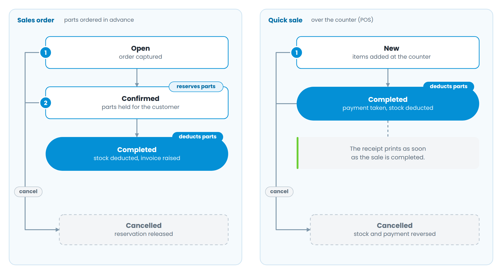

# Part 2 — Selling parts without labour

Figure 5 — The two parts-only routes

**Sales Order** is for parts a customer orders ahead. *Open* captures the order, *Confirmed* reserves the parts against the customer, and *Completed* deducts the stock and raises the invoice. Cancelling releases the reservation.

**Quick Sale** is the counter till. Items are added, payment is taken, and completing the sale deducts stock and prints the receipt in one action. Cancelling a completed quick sale reverses both the stock and the payment.

Both screens have the same advanced product search as the job order, so a counter staff member can find a part by manufacturer or category without knowing the part number.
