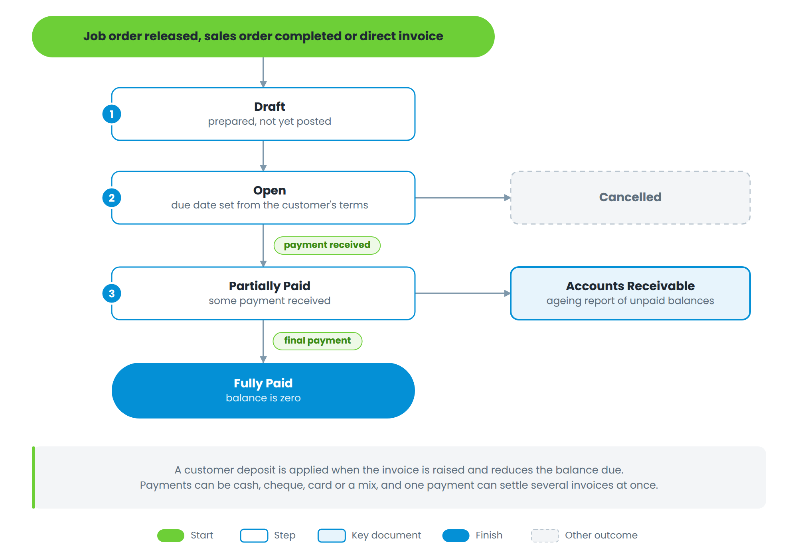

# Part 3 — Billing and collection

Figure 6 — Invoice statuses and how payment moves them

| **Status**     | **Meaning**                                                         |
| -------------- | ------------------------------------------------------------------- |
| Draft          | Prepared but not yet posted                                         |
| Open           | Posted and due; the due date comes from the customer's payment term |
| Partially Paid | Some payment received, a balance remains                            |
| Fully Paid     | The balance is zero                                                 |
| Cancelled      | Voided                                                              |

**Raising an invoice from a job order.** Open the job order and choose *Create Invoice*. The window carries over the customer, the amounts, the prepared-by name and the remarks, and lets you set the invoice number and date. Tick *Release job order* if the vehicle is going out now. **Setting** — where an invoice approver is required, the approver is selected here; where the invoice date is locked, you cannot back-date it.

**Deposits.** A deposit taken earlier is applied when the invoice is raised and reduces the balance due.

**Payments.** A payment can be cash, cheque, card or a mix, and one payment can settle several invoices at once. Cheques are tracked separately through the check register — *For Clearing*, then *Cleared* or *Cancelled*.

**Accounts Receivable.** Every unpaid or partly paid invoice appears in the AR ageing report, grouped by how long it has been outstanding. Statement of Account prints the same information for one customer.
