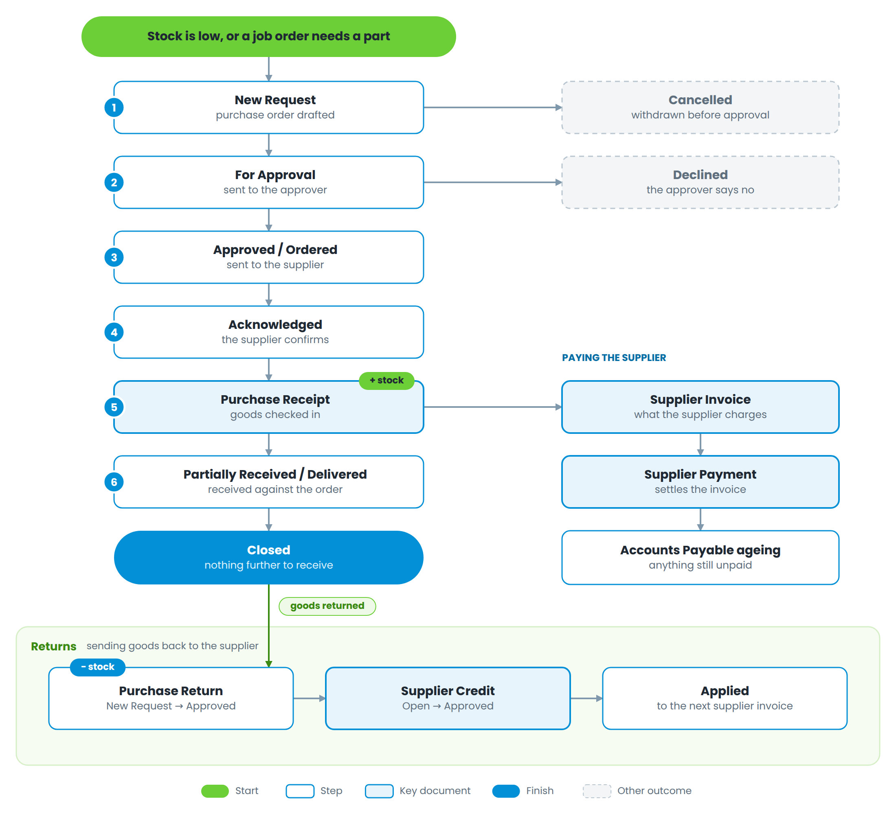

# Part 4 — Inventory and purchasing

Figure 7 — From a purchase order to a paid supplier, and how returns come back

## Purchase orders

| **Status**         | **Meaning**                                    |
| ------------------ | ---------------------------------------------- |
| New Request        | Drafted, not yet submitted                     |
| For Approval       | Waiting on the approver                        |
| Approved / Ordered | Released to the supplier                       |
| Acknowledged       | The supplier has confirmed the order           |
| Partially Received | Some lines received against a purchase receipt |
| Delivered          | Everything ordered has been received           |
| Closed             | No further receipts expected                   |
| Declined           | The approver rejected it                       |
| Cancelled          | Withdrawn                                      |

A purchase order can be raised for stock, or for a specific job order when a part has to be bought in for one car.

## Receiving

A **Purchase Receipt** is what actually raises stock. Receive against the purchase order, check the quantities and the cost, and the on-hand quantity goes up and the moving cost is recalculated. Receiving part of an order moves it to *Partially Received*; receiving the rest moves it to *Delivered*.

## Paying the supplier

The **Supplier Invoice** records what the supplier is charging. The **Supplier Payment** settles it. Anything unsettled shows in the Accounts Payable ageing report.

## Returns and credits

A **Purchase Return** (*New Request* → *Approved*, or *Cancelled*) sends goods back and takes them out of stock. The supplier's **Credit** note is then recorded (*Open* → *Approved*) and applied against later invoices, moving through *Partially Applied* to *Fully Applied*.

## Controlling stock

| **Document**     | **Statuses**                                                            | **Use it when**                                                      |
| ---------------- | ----------------------------------------------------------------------- | -------------------------------------------------------------------- |
| Stock Adjustment | New Request → Approved, or Cancelled                                    | Stock is written off or corrected — defective, stolen, opening stock |
| Stock Transfer   | New Request → Approved → Shipped / Sent → Received; Denied or Cancelled | Stock moves between branches                                         |
| Stock Release    | New Request → Released, or Cancelled                                    | Parts are physically issued from the store to a job                  |
| Cycle Count      | counted, then posted                                                    | A shelf is recounted and the system is corrected                     |
