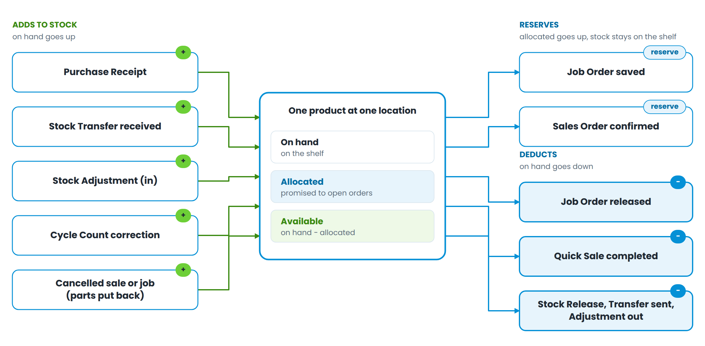

# Part 5 — How stock actually moves

Every product holds three numbers at every location. Getting these three straight prevents most inventory arguments.

| **Number** | **What it is**                                       |
| ---------- | ---------------------------------------------------- |
| On hand    | What is physically on the shelf                      |
| Allocated  | What is promised to open job orders and sales orders |
| Available  | On hand minus allocated — what you may still promise |

Figure 8 — Which documents raise stock, which reserve it, and which deduct it

The rule worth memorising: **saving a job order reserves; releasing it deducts.** A part sitting on an open job order is still on the shelf but is no longer available to sell — which is exactly why the counter shows a lower number than the shelf does.
