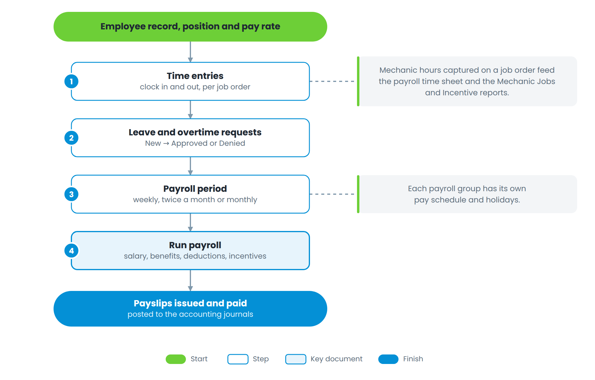

# Part 6 — People and payroll

Figure 9 — From the employee record to the payslip

Mechanic hours are captured on the job order itself, so the same clock-in serves three purposes: it tells the service advisor where the job is, it feeds the incentive calculation, and it fills the payroll time sheet.

Leave and overtime requests follow a simple approval path — *New*, then *Approved*, *Denied* or *Cancelled*. Payroll is then run for a payroll group over its period, which may be weekly, every two weeks, twice a month or monthly.
