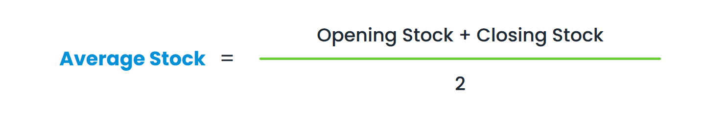

# What is the FSN Report?

The **FSN Report** is a strategic inventory management tool designed to help you understand the health of your stock at a glance. By analyzing how quickly products move through your shop, you can make data-driven decisions on purchasing, pricing, and warehouse organization. This report ensures that your capital isn't trapped in stagnant inventory while ensuring high-demand items are always available for your customers.

1.  **Understanding the Data Range**

The report calculates data based on a specific timeframe, such as **Aug 3, 2025**, to **Feb 3, 2026**.

  - **Period Coverage**: All calculations—Opening Stock, Stock Out, and Turnover—are strictly limited to these dates.

  - **Context**: A turnover ratio of 0.40 over six months suggests a slow pace, but it is important to consider if the item is seasonal (e.g., specific tires for rainy seasons).

2\. **Average Stock**

The mean quantity of a product held in your inventory throughout the selected period.  

  - **Formula**:

  - **Yokohama Tires Example**:
    
    1.  **Opening Stock:** 3 units
    
    2.  **Closing Stock:** 2 units
    
    3.  **Calculation:** 23+2=2.5 units

3\. **Inventory Turnover Ratio (ITR)**

This metric measures the efficiency of your stock by showing how many times you sold through your average inventory levels.

  - **Formula**:

  - **Yokohama Tires Example**:
    
    1.  **Stock Out:** 1 unit sold
    
    2.  **Average Stock:** 2.5 units
    
    3.  **Calculation:** 2.51=0.40

4\. **FSN Classification Rules**

We use your specific turnover thresholds to categorize every item. This classification dictates your shop's inventory strategy:

| **Category**       | **Threshold (Ratio)** | **Yokohama Status**   | **Operational Action**                                                                                   |
| ------------------ | --------------------- | --------------------- | -------------------------------------------------------------------------------------------------------- |
| **F (Fast)**       | **\>4.0**             | *Not Applicable*      | **High Priority:** Keep these in high-visibility areas and automate reordering.                          |
| **S (Slow)**       | **\>1.0**             | *Not Applicable*      | **Moderate Priority**: Keep a steady supply but avoid bulk over-purchasing.                              |
| **N (Non-Moving)** | **≤1.0**              | **0.40 (Non-Moving)** | **Low Priority**: These items are “dead stock”. Consider clearance sales or liquidating to free up cash. |

Export to Sheets

  - **Example Case**: Yokohama Tires

Under these rules, the Yokohama Tires are classified as Non-moving (N). Despite having one sale, the turnover ratio of 0.40 is well below the 1.0 threshold. This indicates that at the current sales rate, these tires will occupy shelf space for a significant amount of time before being fully sold out.
